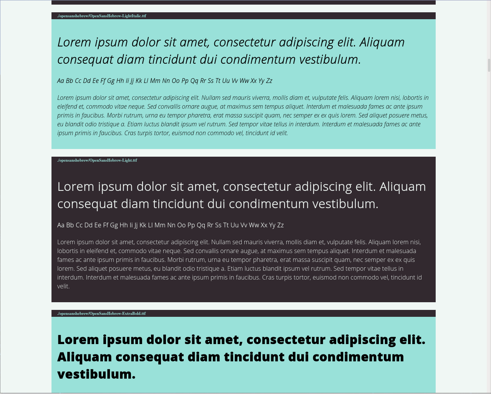

# FontViewer - GPL2

FontViewer is simple shell script that creates FONTS.html file which imports fonts in CSS to preview them (via recursive search, so no need to extract fonts first).

Linux only. I suppose you can get it to work on mac, but I dont guarantee it yet. I have no access to even an old mac to test.

Prefferably add this script to your PATH.

Usage:
```
fonttester.sh
```
This will recursively search for every font file (.ttf .odt and .woff for now) and include them into ./FONTS.html
```
fonttester.sh ~/fonts
```
This will recursively search for fonts in said directory, but FONTS.html will still output in current directory. 
__I suggest using Firefox for big fonts sets (like the one from Google https://github.com/google/fonts).__

Example output from fonttester.sh . 3


Example output from fonttester.sh . 2


Second argument explanation

- 0 English, Polish and Russian alphabet
- 1 English alphabet in 5 sizes
- 2 English alphabet in 1 size
- 3 English lorem ipsum
- 4 Polish alphabet in 5 sizes
- 5 Polish alphabet in 1 size
- 6 Polish lorem ipsum
- 7 Russian alphabet in 5 sizes
- 8 Russian alphabet in 1 size
- 9 Russian lorem ipsum

# TODO
- Add macOS support
- Add import header to be saved separately so FONTS.html can be generated to just contain example patterns and save time generating big fonts sets
